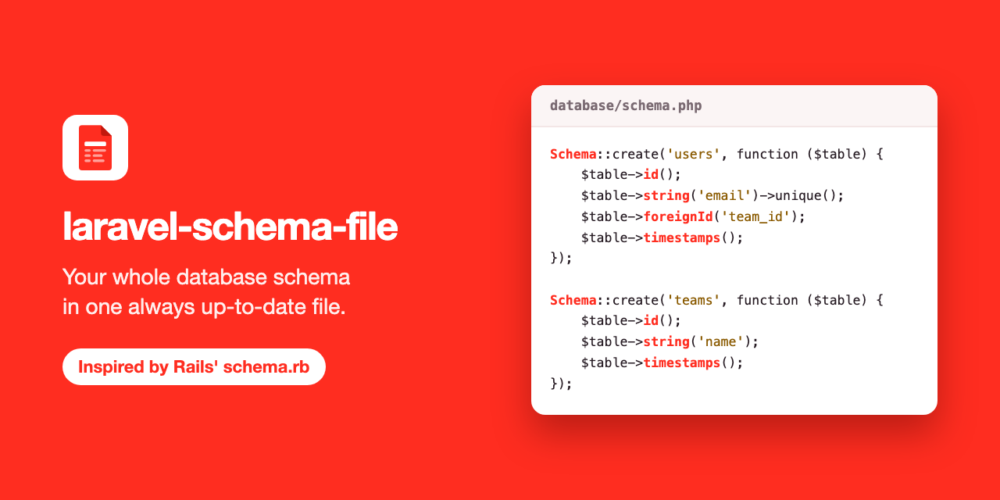

<p align="center">
  
</p>

# Laravel Schema File

One always up-to-date file with your whole database schema, regenerated after every migration.
Inspired by Rails' `schema.rb`.

## Why

In Rails, every `db:migrate` rewrites `db/schema.rb`: a single readable file with every table, column, index and foreign key. You commit it, you read it instead of digging through a hundred migrations, and every schema change shows up in code review as a diff of one file.

Laravel has no such thing. `schema:dump` produces a raw SQL dump, is run by hand, and is meant for squashing migrations rather than for reading.

Laravel Schema File brings the Rails approach to Laravel:

- **One file** — `database/schema.php`, written in the same Blueprint syntax you use in migrations.
- **Always current** — regenerated from the real database after every `migrate` and `migrate:rollback`.
- **Made for git** — stable ordering, so a schema change is a small, reviewable diff.

## Requirements

| | Version |
| --- | --- |
| PHP | 8.3+ |
| Laravel | 13.x |
| Database | MySQL, MariaDB, PostgreSQL, SQLite |

The package relies on Laravel's native schema introspection (
  `Schema::getTables()`,
  `getColumns()`,
  `getIndexes()`,
  `getForeignKeys()`,
), so it needs no `doctrine/dbal`. Only Laravel versions that still receive fixes are supported.

## Installation

```bash
composer require --dev ggermanboldyrev/laravel-schema-file
```

That is all: Laravel discovers the package's service provider automatically.

If you have disabled package discovery, register the provider yourself in `bootstrap/providers.php`:

```php
return [
    App\Providers\AppServiceProvider::class,
    GGermanBoldyrev\SchemaFile\SchemaFileServiceProvider::class,
];
```

## Usage

In the `local` environment there is nothing to run: the schema file is rewritten every time you run `migrate`, `migrate:rollback`, `migrate:fresh` or any other migration command. It is left alone by `--pretend`, and by migrations run on a connection other than the one the file describes.

Everywhere else — tests, CI, production — the file is never touched automatically. The migration command tells you when it has rewritten the file. If the file could not be written, the command still succeeds and prints a warning, which also goes to the log.

To write the file by hand:

```bash
php artisan schema:generate
```

Writes the schema file. The file is left untouched when it already matches the database. The command is also available as `migrate:schema`.

| Option | What it does |
| --- | --- |
| `--check` | Writes nothing. Exits with code `1` if the schema file is missing or out of date, `0` otherwise. |
| `--path=` | Where to write the schema file, for this run only. |
| `--database=` | The database connection to read the schema from, for this run only. |

Use `--check` in CI to catch a migration that was committed without the updated schema file:

```bash
php artisan migrate
php artisan schema:generate --check
```

For an application with more than one database, generate a file per connection:

```bash
php artisan schema:generate --database=analytics --path=database/analytics-schema.php
```

## Configuration

The defaults work without any setup. Each setting can be changed in `.env`:

| Variable | Default | Meaning |
| --- | --- | --- |
| `SCHEMA_FILE_ENABLED` | `true` in `local`, otherwise `false` | Whether migrations rewrite the schema file. |
| `SCHEMA_FILE_PATH` | `database/schema.php` | Where the schema file is written. |
| `SCHEMA_FILE_CONNECTION` | the default connection | The connection whose schema is written. |

The `--path` and `--database` options take precedence over these for a single run.

To edit the config file itself, publish it to `config/schema-file.php`:

```bash
php artisan vendor:publish --tag=schema-file-config
```

The published file has one more setting, `except`: the tables to leave out of the schema file, by exact name or by a pattern where `*` matches anything. The table Laravel tracks migrations in is always left out.

```php
'except' => ['failed_jobs', 'telescope_*', 'pulse_*'],
```

## What the file shows

The file describes the database as it is, not the migrations as they were written. Where a database stores less than a migration said, the file shows what is really there:

| In the migration | MySQL | MariaDB | PostgreSQL | SQLite |
| --- | --- | --- | --- | --- |
| `string('name', 50)` | `string('name', 50)` | `string('name', 50)` | `string('name', 50)` | `string('name')` |
| `json('data')` | `json` | `longText` | `json` | `text` |
| `uuid('id')` | `uuid` | `uuid` | `uuid` | `string` |
| `enum('status', [...])` | `enum` | `enum` | `string` | `string` |
| `unsignedBigInteger('n')` | `unsignedBigInteger` | `unsignedBigInteger` | `bigInteger` | `integer` |
| `dateTime('at')` | `dateTime` | `dateTime` | `timestamp` | `timestamp` |
| `tinyInteger('n')` | `tinyInteger` | `tinyInteger` | `smallInteger` | `integer` |

So the file is the same for everyone only when everyone runs the same database. A type that no Blueprint method creates is written with `rawColumn()`.

Not shown at all: views, triggers, check constraints, and indexes over an expression rather than columns (which is what a full-text index is on PostgreSQL).

## Testing

```bash
composer test
```

Runs everything that needs no database server: the unit tests, and the feature tests on SQLite.

```bash
composer test:all
```

Starts MySQL, MariaDB and PostgreSQL in Docker, runs the whole suite against all four databases, and removes the containers again, whether the tests passed or not. Nothing is left running and no data is kept.

To run against servers of your own, name them and say where they are:

```bash
TEST_DATABASES=mysql,pgsql TEST_MYSQL_PORT=3306 TEST_PGSQL_PORT=5432 vendor/bin/pest
```

Each server takes `TEST_{DRIVER}_HOST`, `_PORT`, `_DATABASE`, `_USERNAME` and `_PASSWORD`. The tests drop every table in the database they are given.

## License

MIT. See [LICENSE](LICENSE).
